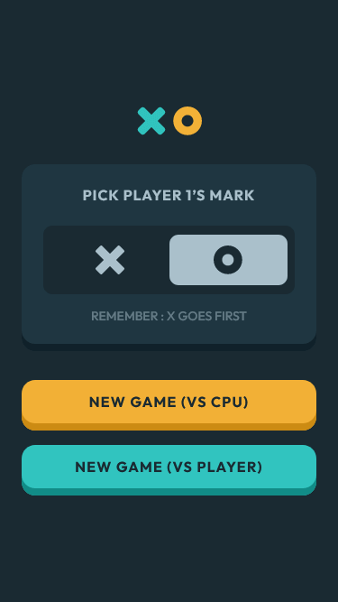
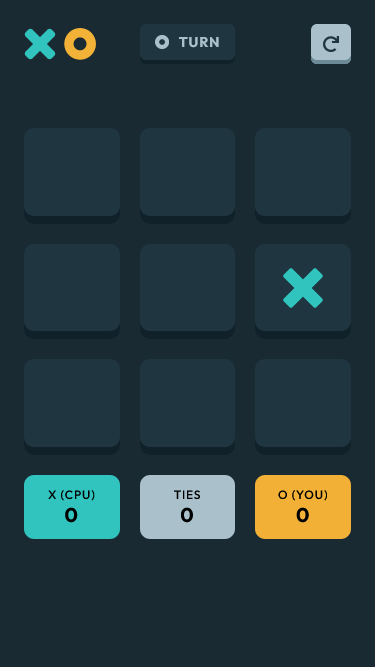
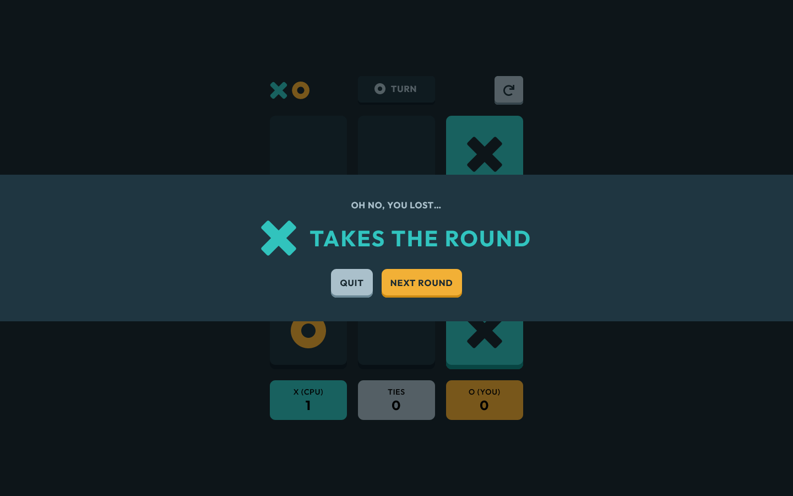

# Frontend Mentor - Tic Tac Toe solution

This is a solution to the [Tic Tac Toe challenge on Frontend Mentor](https://www.frontendmentor.io/challenges/tic-tac-toe-game-Re7ZF_E2v). Frontend Mentor challenges help you improve your coding skills by building realistic projects!

## Table of contents

- [Overview](#overview)
  - [The challenge](#the-challenge)
  - [Screenshot](#screenshot)
  - [Links](#links)
- [My process](#my-process)
  - [Built with](#built-with)
  - [What I learned](#what-i-learned)
  - [Continued development](#continued-development)
  - [Useful resources](#useful-resources)
- [Author](#author)

## Overview

### The challenge

Users should be able to:

- View the optimal layout for the game depending on their device's screen size
- See hover states for all interactive elements on the page
- Play the game either solo vs the computer or multiplayer against another person
- **Bonus 1**: Save the game state in the browser so that it’s preserved if the player refreshes their browser
- **Bonus 2**: Instead of having the computer randomly make their moves, try making it clever so it’s proactive in blocking your moves and trying to win

### Screenshot

- Solution in mobile 📱:




- Solution in desktop 💻:



### Links

- Solution URL: [Click here](https://www.frontendmentor.io/solutions/mobilefirst-tic-tac-toe-game-E-N1gc2LaW)
- Live Site URL: [See live site here](https://juanbonilla.me/FEM_tic-tac-toe-game/)

## My process

### Built with

- Semantic HTML5 markup
- CSS / SASS custom properties
- [CUBE CSS](https://piccalil.li/blog/cube-css/) - CSS Methodology
- Flexbox
- CSS Grid
- Mobile-first workflow
- [React v18](https://reactjs.org/) - JS library
- [Testing library](https://testing-library.com/)
- Test Driven Development

### What I learned

This project was really challenging to me. I found out multiple things that I can improve in general but I discovered how important it’s to make a good plan before writing code. The reason why is simple, I can reduce the amount of refactors needed when my project gets bigger. In this way, I recognize that thinking of a critical route approach will generate a better understanding of the project and it will show me key features to focus on.
 
Separately, speaking more technically, I enjoyed this challenge due to the things I have implemented. Firstly, I wanted to build my code around the TDD technique. So, I started developing the tests and then the code without thinking about styles. This was difficult to achieve but I tried my best to see the importance of producing testable code. Many things appeared during the time I worked on creating tests and code that made me refactor again and again my lines. I consider I gained a lot by doing this because of the knowledge acquired with each failure. Now, I feel that my code still needs some refactors to make it more performant but this will lead to a bunch of questions that could be solved later on.
 
In addition, I perceive I did an interesting exercise by trying to base my styles on [Tailwind](https://tailwindcss.com/) and mix this up with CUBE CSS. I was curious about the implementation of multiple utility classes and how to create them dynamically with SASS loops, mixins and functions. I think this helped me to increase my skills at the time of writing CSS. See below a mixin that creates utility classes for properties that use custom values and return a class selector depending on the breakpoint received:

```scss
@mixin units($label, $breakpoint: null) {
    $property: map-get($properties, $label);

    @each $unit in $units {
        $unit-formated: replace-dot(#{$unit});

        @if $breakpoint {
            .#{$breakpoint}\:#{$label}-#{$unit-formated} {
                #{$property}: multiply-units($unit);
            }
        } @else {
            .#{$label}-#{$unit-formated} {
                #{$property}: multiply-units($unit);
            }
        }
    }
}
```

On the other hand, I didn’t understand how to create a custom hook. This project gave me an idea on how to fulfill it. Therefore, I added a simple animation on my modal that apply the custom hook below:

```js
import { useEffect, useRef, useState } from 'react';

export const useAnimationOnUnmount = (setMount) => {
    const [isComponentSet, setIsComponentSet] = useState(false);
    const componentRef = useRef();

    const setComponentToUnmount = (ref) => {
        componentRef.current = ref;
        setIsComponentSet(true);
    };

    useEffect(() => {
        if (componentRef.current) {
            componentRef.current.addEventListener('animationend', () => {
                setMount(false);
            }, { once: true });
        }
    }, [setMount, isComponentSet]);

    return {
        setComponentToUnmount
    };
}
```

It performs a reusable functionality to let a component that is being unmounted to finish its animation before disappearing suddenly. In other words, this is like animating `display: none;`.

### Continued development

I wanted to apply TDD on this one. However, this was challenging enough to make me think about the importance of keeping practicing this technique to discover more and more of its benefits. Since I was used to developing the software first, starting with testing was a game changer. I tried my best on creating good tests but I recognize that at the beginning it is difficult to get the specific mindset needed to build strong tests. I found TDD really interesting and I will continue implementing this technique on new projects to keep myself learning and discovering potential issues that can be mapped with the help of unit testing.
 
Apart from that, one thing I can strengthen is thinking more before doing. It is convenient to do so due to the potential issues that will appear if you start writing code without identifying the project structure and how requirements are linked to each other. I had to handle numerous situations in which I could have prevented them from happening.
 
Finally, I realized that my repo got a bunch of commits. Some of them could have been grouped instead of sending them separately to the remote repo. This is more of a branch strategy consideration that can help me to keep my work clean once I send it to my main branch. So, I am contemplating starting to create branches that focus on particular features or bug fixes.

### Useful resources

- [TDD with React](https://tddreactjs.com/) - This is a great article to start with TDD. It has a step by step example to make it easy to learn.
- [Rating Radio Group Example](https://www.w3.org/WAI/ARIA/apg/example-index/radio/radio-rating.html) - This article helped me when I wanted to implement a custom radio group element that could be accessible.
- [Function makes the dependencies of useEffect Hook change on every render](https://typeofnan.dev/fix-function-makes-the-dependencies-of-useEffect-hook-change-on-every-render-warning-in-react/) - I had a warning in my GameBoard component, this was an advise to implement useCallback hook. This article explains clearly why React suggested to add this hook and the benefits that it provides.
- [Create copy of multi-dimensional array](https://stackoverflow.com/questions/13756482/create-copy-of-multi-dimensional-array-not-reference-javascript) - I was struggling with my board represented in a 2D array in my tests. I didn't notice that the spread operator (`[...EMPTY_BOARD]`) wasn't removing the references of the values and making my tests fail. This forum answer provides a great explanation about how to clone a multidimensional array effectively or also know as deep copy.
- [JavaScript Event Handlers](https://webaim.org/techniques/javascript/eventhandlers) - Having a better understanding when a user interacts in the page with a keyboard helped me to create a more accessible solution
- [Want CSS variables in media query declarations?](https://bholmes.dev/blog/alternative-to-css-variable-media-queries/) - I wanted to use CSS variables in media queries definition. However, I realized this wasn't working as expected. This article explains clearly why regular variables doesn't work and provide alternatives to solve this issue.
- [Str-replace Function](https://css-tricks.com/snippets/sass/str-replace-function/) - Replacing a string in SASS is a good thing when you want to create class selectors that use a particular character that needs to be formated

## Author

- Website - [juanbonilla.me](https://juanbonilla.me)
- Frontend Mentor - [@juanpb96](https://www.frontendmentor.io/profile/juanpb96)
- LinkedIn - [Juan Bonilla](https://www.linkedin.com/in/juan-pablo-bonilla-6b8730115/)
